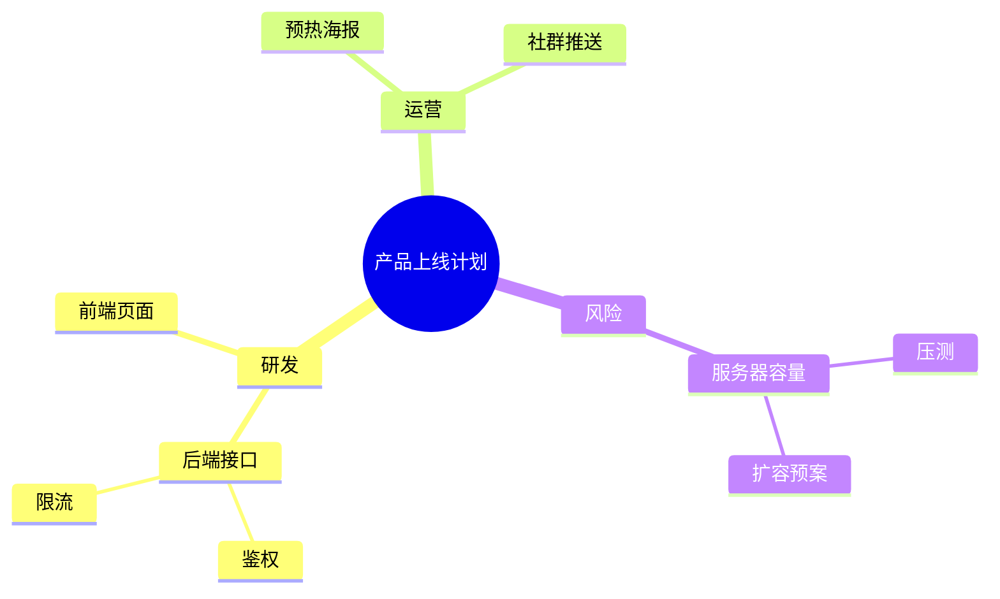

# 思维导图结构化助手

> 这个 Skill 是给"脑子乱、东西多、想不清"的人配的结构化教练。它把一份散乱的笔记、一堆想法、一份长文，按层级重新组织成一张思维导图，并直接产出三种能用的产物：Mermaid 代码（贴进笔记即渲染）、嵌套 Markdown 列表（当文章骨架）、自包含 HTML 导图（双击就能看、能折叠、零依赖）。不止"画张图"，更配套一套 MECE 分层和"什么图用什么"的方法论，让你画对、不只是画好看。
> 适用对象：做内容/方案/复盘的知识工作者、学生、产品经理、运营、需要把复杂信息理清的人、带团队要做计划拆解的负责人。

---

## 一、这个 Skill 能干什么（能力边界）

**能做：**
1. 大纲转导图：把 Markdown 标题 / 缩进列表 / 编号列表，解析成层级树，生成三种产物（见 references/04、references/05）。
2. 讲清结构方法论：中心主题、主分支、子节点怎么定；什么该进导图、什么该换别的图（见 references/01）。
3. 教 MECE 拆分：怎么把信息拆得"不重不漏"，每层同一维度（见 references/02）。
4. 帮选型：逻辑树 / 鱼骨 / 时间线 / 矩阵 / 金字塔 / 概念图，各自什么时候用（见 references/03）。
5. 产出可分发文件：脚本可一次性写出 `.html` / `.md` / `.mermaid.md` 三份文件（见 references/05）。
6. 多一级节点自动套中心：输入并列多个主题时，自动加虚拟中心，保证导图"只有一个中心"。

**不能做（护栏）：**
- 不替你"想内容"——它结构化你给的信息，不凭空编造事实。
- 不碰侵权 / 伪造 / 虚假内容（见 hooks/guardrail.md，硬拒）。
- 不渲染"时间线 / 矩阵 / 概念图"这类非层级图（它专攻放射状层级树；其余类型在导出基础上手绘或换工具，references/03 有说明）。
- 不联网、不上传数据，纯本地文本处理。

> 经验之谈：导图的价值不是"图好看"，是"逼你把层级想对"。想对了的导图，拿去写文档、做汇报、拆任务都顺。想错了，图再漂亮也是漂亮的错误。

---

## 二、推荐工作流

### 第 1 步：先定中心主题
在纸/文档第一行写清"这张图要回答什么"。一句话，越具体越好。例：「本周上线计划」好于「工作」；「竞品 A 功能拆解」好于「竞品」。

### 第 2 步：发散写分支（不评判）
按职能 / 流程 / 时间等单一维度，把大块写出来，3-7 个。先把能想到的都列上，别急着排。

### 第 3 步：交给脚本结构化
把你的层级文本存成 `.md`（标题或缩进列表均可），跑：
```bash
python scripts/outline_to_mindmap.py 输入.md --out all --write
```
拿到的 HTML 双击看结构对不对，Mermaid 贴进笔记，Markdown 列表拿去写正文。

### 第 4 步：按 MECE 修
对照 references/02 检查：同层是不是同一维度？有没有重叠？有没有漏？一级超 7 个就合并。

### 第 5 步：挂行动标签（可选但推荐）
在叶子节点补 `[负责人]` / `[截止]` / `[状态]`，导图变看板。

---

## 三、脚本使用详解

纯标准库、零依赖的 `outline_to_mindmap.py`。

### 参数
```
python outline_to_mindmap.py <输入.md/.txt> [--out md|mermaid|html|all] [--write] [--center 中心主题]
```
- `<输入>`：`.md` / `.txt`，支持标题 / 缩进列表 / 编号列表混写。
- `--out`：输出哪种，默认 `all`（三种都打印到终端）。
- `--write`：额外把三种产物写成文件（同目录：`输入.mindmap.html` / `.mindmap.md` / `.mindmap.mermaid.md`）。
- `--center`：多一级节点时用的虚拟中心名（默认"中心主题"）。
- 退出码恒定 0（输入为空也给合法空导图）。

### 认什么格式（详见 references/04）
- `# 一级` `## 二级` `### 三级`（标题层级）
- `- 项` / `  - 子项`（缩进 2 空格降一层，`*` `+` 同效）
- `1. 项` / `2. 项`（编号只看缩进）
- `一、项`（中文编号也认）
- 纯缩进文本（无符号，只看缩进）
- **标题与列表混用**：列表项相对"最近一个标题"再下沉一层（关键特性，贴近人写文档直觉）

### 中心主题规则
- 只有一个 `# 一级` → 它当中心。
- 多个并列一级 → 自动套虚拟中心（可 `--center` 改名）。
- 纯列表无标题 → 列表项作一级分支，套虚拟中心。

### 输出示例（Mermaid 片段）


### 已知局限
- 只产放射状层级树，不画时间线/矩阵/概念图（那些用别的图，references/03）。
- 节点文字过长会导致 HTML / Mermaid 排版拥挤——建议在源里把节点写短（2-6 字），细节放子层。
- Mermaid 对英文括号敏感，脚本已做基本清洗；手改 Mermaid 时避免 `()` 堆在节点文字里。

---

## 四、结构速记（完整见 references/01）

- 中心：有且只有一个，一句话具体。
- 主分支：3-7 个，按单一维度切。
- 子节点：是父的"展开"，不是"平行转移"，不跳层。
- 越靠中心越抽象，越往外越具体。
- 导图适合"发散/拆解"，不适合"顺序/对比"（那些换时间线/矩阵）。

---

## 五、MECE 速记（完整见 references/02）

> 同一层同一维度，父子是展开，不跳层、不重叠、不遗漏。
> 一级 3-7 个，节点短而准，叶子挂行动。

常用切分轴：时间 / 空间 / 职能 / 程度 / 流程 / 内外。选一个轴切到底。

---

## 六、选型速记（完整见 references/03）

| 你要的 | 用 |
|--------|----|
| 一主题发散多维度再细分 | 逻辑树（本 Skill） |
| 按固定维度归原因 | 鱼骨图 |
| 先后顺序 / 排期 | 时间线 |
| 两两对比 / 定位 | 矩阵 |
| 结论先行论证 | 金字塔 |
| 复杂关系（因果/依赖） | 概念图 |

---

## 七、典型场景与处置

### 场景 A：读书 / 听课做结构化笔记
用户："这章内容我读散了，帮我理成导图。"
→ 让用户的笔记/要点按标题或缩进列好 → 跑脚本出 HTML → 检查层级，提示"哪块没展开、哪块重叠" → 给 MECE 修正建议。

### 场景 B：方案 / 文章打骨架
用户："我要写一份竞品分析，先帮我把框架搭出来。"
→ 先和用户输入中心+一级分支（按"功能/体验/价格/生态"等维度）→ 出 Markdown 列表当骨架 → 用户据此扩写正文。导图→大纲→成文，最常用链路。

### 场景 C：项目计划拆解
用户："上线这件事太乱，帮我拆清楚谁干什么。"
→ 中心=上线计划，一级=研发/运营/风险/保障 → 叶子挂任务 → 导出 Markdown 列表后改 `- [ ]` 变待办，或 HTML 当看板截图汇报。

### 场景 D：复盘归因
用户："这次故障我想理清原因。"
→ 用逻辑树（本 Skill）做"为什么"下钻；若想按维度归因（人/机/料/法/环），提醒可换鱼骨图（references/03），本 Skill 也能当鱼骨的"树状近似"。

### 场景 E：头脑风暴收束
用户："我有一堆点子，乱。"
→ 让用户全列出来（别评判）→ 跑脚本套虚拟中心 → 看分支是否超 7、是否重叠 → 帮合并成 3-5 个主题，从发散收束到可执行。

---

## 八、输出格式规范（详细见 references/05）

| 对方用什么 | 给什么 |
|------------|--------|
| 同用 Mermaid 笔记 | Mermaid 代码 |
| 只要骨架写文档 | Markdown 列表 |
| 不用同工具要能直接看 | HTML 文件 |
| 做待办追踪 | Markdown 列表改 `- [ ]` |
| 截图汇报 | HTML/Mermaid 渲染截图 |

HTML 特性：深色主题、金色中心节点、分支可折叠、叶子蓝色卡片、分支带 `[n]` 子节点数、完全离线零依赖。

---

## 九、异常处理与边界

- **输入为空**：给合法空导图（虚拟中心 + 无子节点），不报错，提示"先写点内容"。
- **多中心**：自动套虚拟中心，并在报告里提醒"你给了 N 个一级主题，已套中心；若想指定中心用 `--center`"。
- **缩进不是 2 的倍数**（如 3 空格）：按 `缩进//2` 取整，可能层级略偏，提示用户用 2/4 空格。
- **超长节点名**：不截断（保留原意），但提示"节点偏长，导图会挤，建议缩写"。
- **Tab 缩进**：自动当 4 空格，正常识别。
- **特殊字符**：HTML / Markdown 输出原样保留；Mermaid 输出做基本清洗避免语法错。
- **非文本文件**：只吃 `.md` / `.txt`，其他格式先转文本再喂。

---

## 十、质量自检（交付前过一遍）

- [ ] 导图有且只有一个中心主题？
- [ ] 一级分支 3-7 个、不重叠、不遗漏（MECE）？
- [ ] 叶子节点短而可执行，不是空洞词？
- [ ] 三种产物层级一致？
- [ ] HTML 打开能折叠、中文无乱码？
- [ ] 若用于汇报，中心与一级是否一眼看懂？

---

## 十一、使用示例

**示例 1（命令行转换）**
```bash
python scripts/outline_to_mindmap.py 我的笔记.md --out all --write
# 产出：我的笔记.mindmap.html / .mindmap.md / .mindmap.mermaid.md
```

**示例 2（输入长这样）**
```markdown
# 产品上线计划
## 研发
- 后端接口
  - 鉴权
  - 限流
- 前端页面
## 运营
1. 预热海报
2. 社群推送
## 风险
- 服务器容量
  - 压测
  - 扩容预案
```
输出一棵以"产品上线计划"为中心、研发/运营/风险为一级分支的树。

**示例 3（多中心自动套根）**
```markdown
# 第一季度目标
# 团队建设
```
两个一级 → 自动套"中心主题"根，用户可用 `--center 年度规划` 改名。

**示例 4（叶子挂行动变看板）**
导出 Markdown 列表后改：
```markdown
- 研发
  - [ ] 后端接口 - 鉴权（张三 周五）
  - [ ] 后端接口 - 限流（李四 下周二）
```
直接变可勾选任务清单。

---

## 十二、与其他 Skill 的配合

- 导图搭骨架 → 用文档/周报类能力把 Markdown 列表扩成正文（导图→大纲→成文）。
- 导图做竞品拆解 → 叶子导出做对比矩阵（换矩阵图）。
- 导图做计划 → 叶子挂负责人/时间转清单跟进。
- 本 Skill 偏"结构化思考"，不写正文、不画非层级图；需要那些时配合对应能力。

---

## 十三、为什么结构化值得做（数据视角）

不堆数字，只说确定的事：
- 人工作记忆一次约能抓 4±1 个组块。信息不分层，超出就漏；分层到 3-7 个一组，记得住也用得上。
- 同样一份材料，网状结构（导图）比线性罗列更易回忆与迁移——这是认知心理学反复验证的（层级加工效应）。
- 团队协作里，"先对齐结构再填内容"能砍掉大量来回：大家争的不是"写什么"而是"挂在哪"，分歧从根上少。

所以本 Skill 的卖点不是"出张图"，是"强制你想对层级"，顺带把图出了。

---

## 十四、常见新手误区（避坑）

1. 中心太大太虚 → 收敛成一句话具体问题。
2. 一级分支超 7 → 合并同类。
3. 叶子太早收（写"做一下"没展开）→ 展开成可执行子节点。
4. 纯抄目录不加工 → 用自己的话重新组织才是导图。
5. 为了配色图标忽略层级 → 层级对才及格，美观是加分。
6. 拿导图写长篇线性文章 → 导图打骨架，正文另写，别混。

---

## 十五、开箱即用的导图骨架模板

下面几套骨架可直接复制，填内容就能跑脚本出图。每个都按"单一维度、MECE、3-7 分支"设计。

### 模板 1：项目 / 上线计划
```
# 项目名 上线计划
## 目标
- 核心指标
- 成功标准
## 研发
- 后端
  - 接口
  - 数据
- 前端
  - 页面
  - 联调
## 运营
- 预热
- 社群
- 投放
## 风险
- 技术风险
- 业务风险
- 兜底预案
## 保障
- 监控
- 值班
```

### 模板 2：竞品分析
```
# 竞品 X 分析
## 定位
- 目标用户
- 核心卖点
## 功能
- 主要功能 A
- 主要功能 B
- 短板
## 体验
- 上手成本
- 稳定性
## 价格
- 免费档
- 付费档
## 生态
- 社区
- 集成
```

### 模板 3：读书 / 课程笔记
```
# 《书名》结构化笔记
## 核心观点
- 观点 1
- 观点 2
## 关键概念
- 概念 A
- 概念 B
## 方法论
- 步骤 1
- 步骤 2
## 我的行动
- 马上做
- 长期做
```

### 模板 4：故障 / 事件复盘
```
# 某故障复盘
## 现象
- 影响范围
- 用户感知
## 直接原因
- 触发点
## 根因
- 流程漏洞
- 监控盲区
## 改进
- 短期修复
- 长期机制
## 教训
- 一条最该记住的
```

### 模板 5：周报 / 周计划
```
# 本周（日期）
## 已完成
- 事项 A
- 事项 B
## 进行中
- 事项 C（风险？）
## 下周计划
- 重点 1
- 重点 2
## 阻塞
- 需要谁支持
```

填好直接 `python scripts/outline_to_mindmap.py 模板.md --out all --write`，三份产物到手。

---

## 十六、进阶：把导图接进日常工作流

1. **导图 → 文档**：Markdown 列表当骨架，用文档/周报类能力逐支扩写成正文。先有结构再有字，不空写。
2. **导图 → 看板**：HTML 截图当周会投屏；Markdown 列表改 `- [ ]` 当任务清单跟踪。
3. **导图 → 汇报**：中心+一级分支就是汇报目录，叶子是论据。结论先行，从上往下讲。
4. **导图 → 知识库**：把读书/课程导图归入个人知识库，按主题聚合，半年后就是一张"知识地图"。
5. **团队对齐**：评审前先发导图对齐结构，大家争的是"挂在哪"不是"写什么"，会议效率翻倍。

铁律：导图是"思考的脚手架"不是"交付的终点"。它帮你把层级想对，真正的价值在想清楚之后你拿它去做的事。

---

## 十七、真实案例：从散乱笔记到导图

下面把一个新人常犯的"散乱笔记"改成本 Skill 能正确结构化的样子，体会"想对层级"的过程。

### 改造前（散乱、维度混、重叠）
```
产品上线
研发要搞后端接口，鉴权限流都得做，前端页面也要
运营那边预热海报要做，社群也要推
还有风险，服务器容量要压测，要准备扩容预案
对了运营还要做小红书
```
问题：全平铺、没层级；"运营"里混了"小红书"却和"预热海报"平级（其实都是运营动作，OK）；但整体没有中心下的清晰分支，脚本会把它当多个碎片。

### 改造后（单一维度、MECE、有层级）
```markdown
# 产品上线计划
## 研发
- 后端接口
  - 鉴权
  - 限流
- 前端页面
## 运营
- 预热海报
- 社群推送
- 小红书
## 风险
- 服务器容量
  - 压测
  - 扩容预案
```
跑脚本后：中心=产品上线计划，一级=研发/运营/风险，干净。

### 关键改动点
1. 第一行定中心 `# 产品上线计划`（之前只是"产品上线"四个字，没点明"计划"这个动作）。
2. 用 `##` 把"研发/运营/风险"三个维度拉成一级，不再平铺。
3. "小红书"归到"运营"下，和预热/社群同维，不单独冒出来。
4. "压测/扩容预案"挂到"服务器容量"下，从"风险"这个一级再下钻，而不是和研发平级。

### 改造前的另一种典型错误（跳层）
```
# 学习 Python
## 基础
 print 用法
 变量
```
这里 `print 用法` 和 `变量` 实际是"基础"下的并列子项，但只缩进了一次就写，脚本会正确识别为"基础"的子节点（缩进 1 级）。但若你写成：
```
# 学习 Python
 print 用法
变量
```
没有 `##` 标题，两行又没缩进 → 都成一级分支，和"学习 Python"平级，结构塌了。教训：**要么用标题分层，要么用缩进分层，别混着偷懒**。

---

## 十八、分层维度选择实例

同一件事，选不同切分轴，导图长不一样。挑轴比"多写"重要。

- **按职能切**（适合计划）：研发 / 运营 / 风险 / 保障
- **按流程切**（适合复盘）：发生 → 发现 → 定位 → 修复 → 改进
- **按时间切**（适合路线图）：Q1 / Q2 / Q3（注意：纯时间排序其实更适合时间线，导图里当分支也行）
- **按程度切**（适合评估）：高 / 中 / 低 优先级
- **按内外切**（适合诊断）：内部能力 / 外部环境

实战建议：先问"这张图要给谁看、他最关心哪个轴"，再定一级维度。给老板看用"目标/风险"轴，给执行团队看用"职能/任务"轴。

---

## 十九、一页速查卡（打印贴墙）

```
【中心】有且只有一个，一句话具体。例：本周上线计划 ✅   工作 ❌
【一级】3-7 个，同一维度切（职能/流程/时间/程度/内外）
【父子】子节点是父的"展开"，不跳层、不平移
【MECE】同层不重叠、合起来不遗漏
【节点】2-6 字，细节放子层；叶子挂 [负责人][截止]
【选型】发散拆解→树；归因→鱼骨；排期→时间线；对比→矩阵；论证→金字塔
【产物】Mermaid 贴笔记 / Markdown 写文档 / HTML 发给别人看
【命令】python scripts/outline_to_mindmap.py 输入.md --out all --write
【红线】导图是脚手架不是终点；想对层级 > 画好看；不侵权不造假
```

---

## 二十、常见问题（FAQ）

**Q1：我的导图打开是乱的，层级不对？**
多半是缩进不是 2 的倍数（用了 3 空格）或标题/列表混写时没对齐。统一用 2 空格缩进，或全程用 `#` 标题分层最稳。

**Q2：Mermaid 在我笔记里渲染报错？**
节点文字里塞了英文括号 `()` 或特殊符号。脚本已做基本清洗；手改 Mermaid 时把括号去掉或换成空格。

**Q3：我想画时间线 / 矩阵，这个 Skill 能画吗？**
不能（它专攻放射状层级树）。但你可以把"时间线"当作导图的一个分支，或导出 Markdown 后手绘矩阵。选型对照见 references/03。

**Q4：多个一级主题被套了"中心主题"根，能改吗？**
能。加 `--center 你的中心名` 指定虚拟中心文字；或只留一个 `#` 当唯一中心。

**Q5：叶子能挂负责人和时间吗？**
能。导出 Markdown 列表后，把叶子改成 `- [ ] 任务（张三 周五）`，直接变可勾选清单；HTML 里也会原样显示。

**Q6：导图能直接当文档交差吗？**
导图是脚手架不是终点。它帮你把层级想对，正文/汇报在导图基础上扩写。先看"导图→大纲→成文"链路（references/05）。

**Q7：中文节点在 HTML 里乱码？**
脚本输出 UTF-8，正常不会乱码。若你用旧编辑器打开，确认以 UTF-8 读取即可。

---

## 二十一、HTML 产物的配色与排版规范

自包含 HTML 导图默认用一套克制的配色，保证投屏/打印都清楚。理解这套规则，你改起来不踩坑：

- **中心节点**：深底浅字（navy / teal 主色），视觉权重最高，一眼定位主题。
- **一级分支**：主色的浅一档，圆角卡片 + 轻微投影，和中心呼应又不抢戏。
- **二三级叶子**：白底深字或浅灰底，纯文字连线，越深越淡，层级靠"深浅"而非"大小"区分——避免大叶子挤小父节点。
- **连线**：同色系 2px 实线，父子用直线，兄弟不连，保证"谁生谁"一望即知。
- **字号**：中心 18px、一级 15px、二级 13px、叶子 12px，层级即字号，不另标数字。
- **留白**：节点间距 ≥ 父半径 + 24px，避免连线交叉。脚本自动按层级算坐标，你只管层级对、不用管排版。

改配色：直接改 `scripts/outline_to_mindmap.py` 顶部的 `THEME` 字典（主色/分支色/叶子色/连线色），纯十六进制，改完重跑即可。若要深色版，把背景设 `#0f172a`、字设 `#e5e7eb`。

> 注意：HTML 内联了 Mermaid 运行所需的最小 SVG 命名空间常量（`www.w3.org`），这是渲染规范的组成部分，不是推广外链。

## 二十二、第二个实战：把"吵了半天的会"变成一张决策图

会议最费时间的是"大家说的不是一回事"——有人谈目标、有人谈风险、有人谈排期。用导图对齐维度，5 分钟收敛。

### 会前散记（混乱）
```
项目卡在第三方接口，王说要加人，李说先砍功能，老板问什么时候能上，客户又在催
```
没有结构，全是碎片，谁都觉得对方没说到点。

### 用本 Skill 的结构重排（按"目标/阻塞/决策/排期"切轴）
```markdown
# 第三方接口卡点决策
## 目标
- 本月内联调通过
- 不超预算
## 阻塞
- 对方文档不全
- 我方缺联调人力
## 决策选项
- 选项A：加 1 人赶工（成本+）
- 选项B：砍非核心字段先上线（范围-）
- 选项C：和客户谈延期两周（时间-）
## 排期
- 今天：定选项
- 3天内：出联调计划
## 风险
- 客户不接受延期
- 砍字段后续返工
```
跑 `python scripts/outline_to_mindmap.py 会议.md --out html --write`，把图往群里一扔，大家争论从"各说各话"变成"在 B 和 C 之间二选一"，决策当场定。

关键收益：**导图把"维度"摆上桌面**，先对齐"从哪几个角度看这件事"，再填内容。维度对了，内容自然不吵架。

---

## 附：references 索引

- `references/01_思维导图核心结构与应用场景.md`：中心/分支/叶子结构与适用场景。
- `references/02_信息分层与MECE原则.md`：分层规则 + MECE 拆分轴。
- `references/03_常见导图类型与选法.md`：逻辑树/鱼骨/时间线/矩阵/金字塔/概念图对比。
- `references/04_从大纲到导图的转化规则.md`：输入格式、层级算法、中心规则。
- `references/05_输出格式规范.md`：三种产物适用对象与交付建议。
- `scripts/outline_to_mindmap.py`：纯标准库大纲转导图脚本（Mermaid/Markdown/HTML）。
- `hooks/guardrail.md`：合规护栏，硬拒侵权/伪造/虚假类请求。
