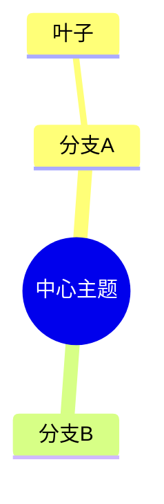

# 输出格式规范

本 Skill 产出三种格式，各有最佳用途。这篇讲清"什么时候用哪个、给对方时怎么交付"。

---

## 一、Mermaid 代码（`.mermaid.md`）

**结构**：

**适用**：
- 你自己用支持 Mermaid 的笔记 / 文档 / Wiki（大多内置渲染）。
- 想继续在图形界面里拖拽、调样式。
**不适用**：对方环境不支持 Mermaid 时（纯微信/纯邮件看不见图）。

**注意**：Mermaid 对特殊字符敏感，本脚本已做基本清洗；若你手改，避免节点文字里塞 `()` 和过长的英文括号。

---

## 二、嵌套 Markdown 列表（`.md`）

**结构**：
```
- 分支A
  - 叶子
- 分支B
```
**适用**：
- 当"文章骨架"继续写正文（导图 → 大纲 → 成文，最常用链路）。
- 贴进任何支持 Markdown 的地方（几乎全支持）。
- 做"可勾选清单"：把叶子改成 `- [ ] 任务` 就变待办。
**不适用**：需要"看图形"的场合（纯文字层级，没有可视化）。

---

## 三、自包含 HTML（`.html`）

**结构**：单文件，内置 CSS，节点可折叠（点分支收起/展开）。
**适用**：
- 发给不使用同一套工具的人（双击就能看，零依赖、零联网）。
- 做汇报截图（深色主题、金色中心节点，出图好看）。
- 当轻量"个人知识看板"。
**不适用**：需要协同编辑（HTML 是静态产物，改了要重新生成）。

**特性**：
- 根节点金色高亮，分支可折叠，叶子蓝色卡片。
- 分支带子节点数标记 `[n]`。
- 完全离线，不加载任何外部字体/脚本/图片。

---

## 四、交付建议（按对象）

| 对方用什么 | 给什么 |
|------------|--------|
| 同用 Mermaid 笔记 | Mermaid 代码 |
| 只要文字骨架去写文档 | Markdown 列表 |
| 不用同一工具、要能直接看 | HTML 文件 |
| 要做成待办追踪 | Markdown 列表 + 改 `- [ ]` |
| 要截图汇报 | HTML 打开截图，或 Mermaid 渲染截图 |

---

## 五、质量自检（交付前过一遍）

- [ ] 导图有且只有一个中心主题？
- [ ] 一级分支 3-7 个、不重叠、不遗漏（MECE）？
- [ ] 叶子节点是可执行 / 可记的短句，不是空洞词？
- [ ] 三种产物层级一致（没有哪种产物的树长歪了）？
- [ ] HTML 打开能折叠、无乱码（中文 UTF-8）？
- [ ] 若用于汇报，中心主题和一级分支是否"一眼看懂"？

---

## 六、和本 Skill 其他能力的配合

- 导图搭完骨架 → 用"周报/文档生成"类能力把 Markdown 列表扩成正文。
- 导图做竞品拆解 → 把叶子导出后做对比矩阵。
- 导图做项目计划 → 叶子挂负责人/时间，转成清单跟进。
